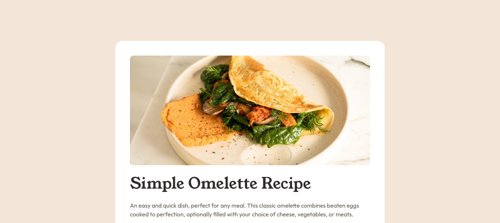

# Frontend Mentor - Recipe page solution

This is a solution to the [Recipe page challenge on Frontend Mentor](https://www.frontendmentor.io/challenges/recipe-page-KiTsR8QQKm). Frontend Mentor challenges help you improve your coding skills by building realistic projects. 

## Table of contents

- [Overview](#overview)
  - [Screenshot](#screenshot)
  - [Links](#links)
- [My process](#my-process)
  - [Built with](#built-with)
  - [What I learned](#what-i-learned)
- [Author](#author)

## Overview

### Screenshot

### Links

- Solution URL: [https://github.com/nikolav-code/recipe-page](https://github.com/nikolav-code/recipe-page)
- Live Site URL: [https://nikolav-code.github.io/recipe-page](https://nikolav-code.github.io/recipe-page)

## My process

### Built with

- HTML
- CSS

### What I learned

- How to load and use custom fonts with @font-face.
- How to style a layout using responsive media queries.
- How to style lists and tables.
- How to fix font rendering issues like unexpected spacing using line-height.

## Author

nikolav-code
